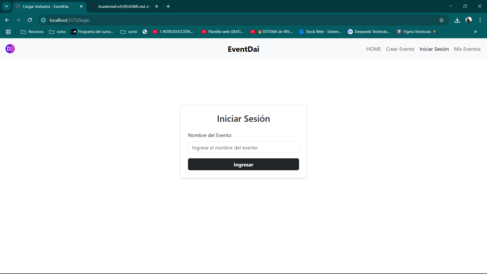

# 📋 App de Gestión de eventos

Aplicación web simple para crear, editar, eliminar y listar eventos e invitados. Está dividida en dos partes: un backend con Express y un frontend con Vue (Vite).

---

## ⚙️ Tecnologías usadas

- 🔙 **Backend:** Node.js + Express (API REST)
- 🔜 **Frontend:** Vue + Vite
- 🎨 **Estilos:** CSS básico
- 🔧 **Control de versiones:** Git

---

## 🚀 Instalación y ejecución

### 1. Clonar el repositorio

```bash
git clone https://github.com/DaiaZabala/AcademiaForIt
cd AcademiaForIt
```

### 2. Instalar dependencias del backend

```bash
cd backend
npm install
```

### 3. Ejecutar el backend

```bash
npm start
```

> El backend por defecto corre en `http://localhost:3000`

### 4. Instalar dependencias del frontend

```bash
cd ../frontend
npm install
```

### 5. Ejecutar el frontend

```bash
npm run dev
```

> El frontend por defecto corre en `http://localhost:5173`

---

## 🧪 Uso

- Acceder al frontend desde tu navegador:(http://localhost:5173)
- Iniciar sesión para comenzar a gestionar tus eventos
- Crear nuevos eventos con nombre, descripción y fecha
- Visualizar un listado de todos tus eventos creados
- Agregar invitados a cada evento (manual o por carga masiva)
- Editar o eliminar información de los invitados
- Confirmar asistencia de invitados
- Ver mensajes de confirmación o eliminación en pantalla

---

## 🌐 Variables de entorno

Podés configurar estas variables si es necesario:

- `BACKEND_URL`: URL base de la API (por ejemplo, `http://localhost:3000`)
- `FRONTEND_PORT`: Puerto del frontend (por defecto Vite usa `5173`)

---


## 📸 Capturas de pantalla

  
  
  
  
  
  
  
  

---

## 👩‍💻 Autor

**Daiana Zabala**

---

## 📄 Licencia

Este proyecto está bajo la licencia MIT. Podés usarlo libremente.
